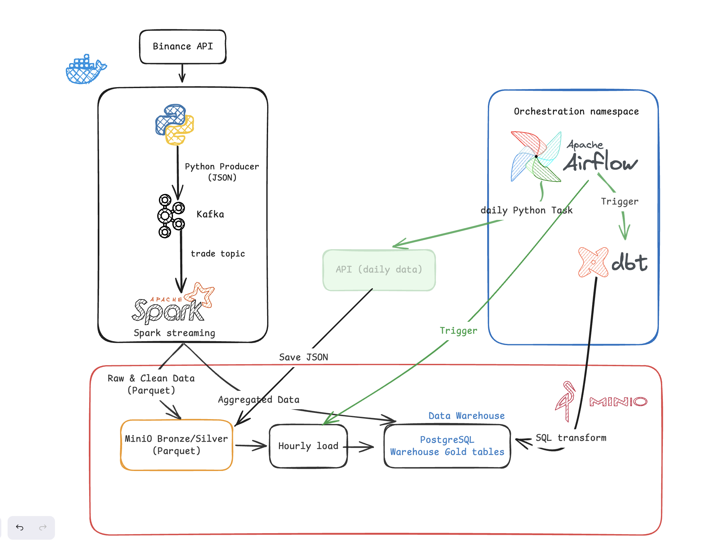

# 🪙 Binance API DataLakeHouse

A real-time cryptocurrency data pipeline built with modern data engineering tools. This project streams live trade data from Binance WebSocket API, processes it through a medallion architecture (Bronze → Silver → Gold), and visualizes insights in Metabase.

---

## 📐 Architecture Overview



```


┌─────────────────────────────────────────────────────────────────┐
│                     DATA SOURCES                                │
│                  Binance WebSocket API                          │
│         (BTC, ETH, BNB, SOL, XRP, ADA, DOGE, SHIB)            │
└─────────────────────────┬───────────────────────────────────────┘
                          │ aggTrade stream
                          ▼
┌─────────────────────────────────────────────────────────────────┐
│                    MESSAGE QUEUE                                 │
│                 Apache Kafka + Zookeeper                        │
│               Topic: crypto_trade_price_1                       │
└─────────────────────────┬───────────────────────────────────────┘
                          │
          ┌───────────────┼───────────────┐
          ▼               ▼               ▼
┌──────────────────────────────────────────────────────────────────┐
│                  SPARK PROCESSING (Medallion Architecture)       │
│                                                                  │
│  🥉 BRONZE          🥈 SILVER          🥇 GOLD                   │
│  Raw Parquet   →   Cleaned Parquet  →  Aggregated (1-min OHLCV) │
│  MinIO/bronze      MinIO/silver        PostgreSQL                │
└──────────────────────────────────────────────────────────────────┘
                                                │
                                                ▼
┌─────────────────────────────────────────────────────────────────┐
│                     VISUALIZATION                               │
│                        Metabase                                 │
│            Candlestick charts, volume analysis                  │
└─────────────────────────────────────────────────────────────────┘
```

---

## 🛠️ Tech Stack

| Layer | Technology |
|---|---|
| **Data Source** | Binance WebSocket API (aggTrade stream) |
| **Message Queue** | Apache Kafka 7.4.0 + Zookeeper |
| **Stream Processing** | Apache Spark 3.5 (PySpark) |
| **Data Lake** | MinIO (S3-compatible object storage) |
| **Data Warehouse** | PostgreSQL 13 |
| **Orchestration** | Apache Airflow 2.7.1 |
| **Visualization** | Metabase |
| **Containerization** | Docker + Docker Compose |

---

## 📁 Project Structure

```
Binance_API_DataLakeHouse/
├── docker-compose.yaml                          # All services definition
├── dockerfile                                   # Airflow custom image
├── dockerfile.spark                             # Spark custom image (with JARs)
├── requirements.txt                             # Python dependencies
├── .env                                         # Environment variables
│
├── kafka_producer/
│   └── Binance_kafka_producer.py               # WebSocket → Kafka producer
│
├── scripts/
│   ├── spark_stream_bronze_ingestion_data.py   # Kafka → MinIO Bronze
│   ├── spark_stream_silver_transform_data.py   # Bronze → MinIO Silver
│   └── spark_stream_gold_aggregate_modelling_data.py  # Silver → PostgreSQL
│
├── dags/                                        # Airflow DAGs
├── logs/                                        # Airflow logs
└── plugins/                                     # Airflow plugins
```

---

## 🗄️ Medallion Architecture

### 🥉 Bronze Layer — Raw Ingestion
- Reads raw trade events from Kafka topic `crypto_trade_price_1`
- Stores as Parquet files in `MinIO/bronze/crypto_trades/`
- Partitioned by `year / month / day / hour`
- No transformation — raw data preserved as-is

### 🥈 Silver Layer — Cleaned & Enriched
- Reads from Bronze Parquet
- Filters out nulls, zero prices, and anomalous values (price > $1M)
- Adds derived columns:
  - `trade_value` = price × quantity
  - `trade_side` = BUY or SELL
  - `price_magnitude` = log10(price)
  - `is_large_trade` = trade_value > $10,000
- Deduplicates on `[symbol, trade_timestamp, price, quantity]`
- Stores as Parquet in `MinIO/silver/crypto_trades/`
- Partitioned by `year / month / day`

### 🥇 Gold Layer — Aggregated OHLCV Candles
- Reads from Silver Parquet
- Computes **1-minute OHLCV candles** per symbol:
  - `open_price`, `high_price`, `low_price`, `close_price`
  - `total_volume`, `trade_count`
  - `buy_volume_taker`, `sell_volume_maker`
- Writes to PostgreSQL table `fact_market_candles`

---

## 🚀 Getting Started

### Prerequisites
- Docker Desktop (with Rosetta enabled for Apple Silicon)
- Python 3.11+
- pyenv (recommended)

### 1. Clone the repository
```bash
git clone https://github.com/yourusername/Binance_API_DataLakeHouse.git
cd Binance_API_DataLakeHouse
```

### 2. Create `.env` file
```env
MINIO_ROOT_USER=minioadmin
MINIO_ROOT_PASSWORD=minioadmin123
MB_DB_HOST=postgres
_AIRFLOW_WWW_USER_USERNAME=admin
_AIRFLOW_WWW_USER_PASSWORD=admin
AIRFLOW_UID=50000
MINIO_ENDPOINT=http://minio:9000
MINIO_ACCESS_KEY=minioadmin
MINIO_SECRET_KEY=minioadmin123
POSTGRES_USER=admin
POSTGRES_PASSWORD=adminpassword
```

### 3. Create required folders
```bash
mkdir -p dags logs plugins scripts
```

### 4. Start all services
```bash
docker compose up --build -d
```

### 5. Initialize databases
```bash
# Initialize Airflow
docker compose run --rm airflow-init

# Create warehouse database
docker exec -it de_postgres psql -U admin -d postgres -c "CREATE DATABASE warehouse_db;"
docker exec -it de_postgres psql -U admin -d warehouse_db -c "
CREATE TABLE IF NOT EXISTS fact_market_candles (
    candle_start_time TIMESTAMP,
    symbol VARCHAR(20),
    open_price DOUBLE PRECISION,
    high_price DOUBLE PRECISION,
    low_price DOUBLE PRECISION,
    close_price DOUBLE PRECISION,
    total_volume DOUBLE PRECISION,
    buy_volume_taker DOUBLE PRECISION,
    sell_volume_maker DOUBLE PRECISION,
    trade_count BIGINT,
    ingested_at TIMESTAMP
);"
```

### 6. Create MinIO buckets
Go to http://localhost:9001 and create: `bronze`, `silver`, `gold`

---

## ▶️ Running the Pipeline

### Step 1 — Start Kafka Producer
```bash
pip install confluent-kafka websocket-client python-dotenv
python kafka_producer/Binance_kafka_producer.py
```

### Step 2 — Copy scripts to Spark container
```bash
docker cp scripts/spark_stream_bronze_ingestion_data.py de_spark_master:/opt/bitnami/spark/scripts/
docker cp scripts/spark_stream_silver_transform_data.py de_spark_master:/opt/bitnami/spark/scripts/
docker cp scripts/spark_stream_gold_aggregate_modelling_data.py de_spark_master:/opt/bitnami/spark/scripts/
docker cp .env de_spark_master:/opt/bitnami/spark/scripts/.env
```

### Step 3 — Run Bronze (Kafka → MinIO)
```bash
docker exec -it de_spark_master spark-submit \
  --master spark://spark-master:7077 \
  /opt/bitnami/spark/scripts/spark_stream_bronze_ingestion_data.py
```

### Step 4 — Run Silver (Bronze → MinIO)
```bash
docker exec -it de_spark_master spark-submit \
  --master spark://spark-master:7077 \
  /opt/bitnami/spark/scripts/spark_stream_silver_transform_data.py
```

### Step 5 — Run Gold (Silver → PostgreSQL)
```bash
docker exec -it de_spark_master spark-submit \
  --master spark://spark-master:7077 \
  --jars /opt/bitnami/spark/jars/postgresql-42.6.0.jar \
  /opt/bitnami/spark/scripts/spark_stream_gold_aggregate_modelling_data.py
```

---

## 🌐 Service URLs

| Service | URL | Credentials |
|---|---|---|
| Airflow | http://localhost:8081 | admin / admin |
| Spark Master UI | http://localhost:8082 | — |
| MinIO Console | http://localhost:9001 | minioadmin / minioadmin123 |
| Metabase | http://localhost:3000 | set on first launch |
| Kafka | localhost:9092 | — |
| PostgreSQL | localhost:5433 | admin / adminpassword |

---

## 📊 Metabase Setup

1. Open http://localhost:3000 and complete setup
2. Add PostgreSQL data source:
   - **Host:** `postgres`
   - **Port:** `5432`
   - **Database:** `warehouse_db`
   - **Username:** `admin`
   - **Password:** `adminpassword`
3. Browse `fact_market_candles` and build dashboards

### Suggested Charts
- **OHLCV Candlestick** — Close price over time per symbol
- **Volume comparison** — Total volume by symbol (bar chart)
- **Buy vs Sell pressure** — buy_volume_taker vs sell_volume_maker
- **Trade count heatmap** — Activity by hour and symbol

---

## 📦 Supported Coins

| Symbol | Pair |
|---|---|
| BTC | BTCUSDT |
| ETH | ETHUSDT |
| BNB | BNBUSDT |
| SOL | SOLUSDT |
| XRP | XRPUSDT |
| ADA | ADAUSDT |
| DOGE | DOGEUSDT |
| SHIB | SHIBUSDT |

---

## ⚠️ Notes

- **Apple Silicon (M1/M2/M3):** Enable Rosetta in Docker Desktop → Settings → General → "Use Rosetta for x86/amd64 emulation"
- **Port 8080 conflict:** Spark Master is mapped to `8082` to avoid conflicts with other local services
- **trigger(once=True):** All Spark jobs are batch-triggered — rerun manually to process new data
- **startingOffsets:** Bronze script uses `"earliest"` to consume all available Kafka messages

---

## 📝 License

MIT License — feel free to use and modify for your own projects.
